# IoT Telemetry Platform

> An event-driven IoT telemetry platform — ingest, store, evaluate, alert, and visualize device data in real time. Built on NestJS microservices with MQTT, TimescaleDB, RabbitMQ, and Grafana.

<p align="center">
  
  
  
  
  
  
  
  
  
  
  
</p>

<p align="center">
  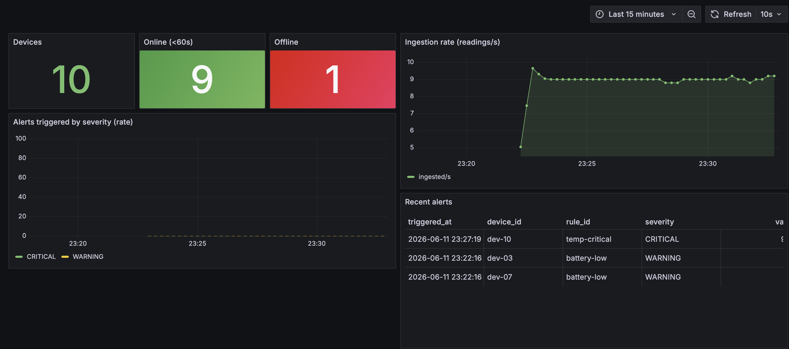
</p>

A simulated fleet of devices streams telemetry over MQTT. The platform ingests it, persists time-series data, evaluates declarative alerting rules through an event-driven pipeline, and surfaces everything on live Grafana dashboards — while every service exposes Prometheus metrics for observability.

---

## Contents

- [Architecture](#architecture)
- [Tech stack](#tech-stack)
- [Features](#features)
- [Visual tour](#visual-tour)
- [Data flow & contracts](#data-flow--contracts)
- [Alerting rules](#alerting-rules)
- [API](#api)
- [Architecture decisions](#architecture-decisions)
- [Project structure](#project-structure)
- [Getting started](#getting-started)
- [Inspecting the stores](#inspecting-the-stores)
- [Observability](#observability)
- [Scope](#scope)
- [License](#license)

---

## Architecture

The platform is four single-responsibility NestJS services wired together by an MQTT broker and a RabbitMQ event backbone. Data fans out to a time-series store (TimescaleDB) and a fast key-value store (Redis); a read-only Query API serves it over REST and gRPC; Prometheus and Grafana close the observability loop.

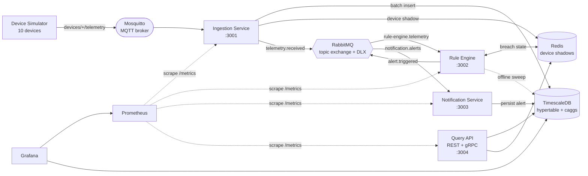

**The full flow:** a device publishes a reading → Mosquitto → Ingestion validates and batch-writes it to TimescaleDB, caches the latest reading in Redis, and emits `telemetry.received` → the Rule Engine evaluates declarative rules (tracking sustained breaches in Redis) and emits `alert.triggered` → the Notification Service persists the alert and fires a webhook mock → the Query API and Grafana read it all back.

## Tech stack

Each technology has a specific role in the platform:

| Technology | Role in the platform | Why it's here |
|---|---|---|
| **NestJS + TypeScript** | 4 microservices | Modular DI and an opinionated structure that scales across services; TypeScript throughout. |
| **Mosquitto (MQTT)** | Device ingress | The de-facto lightweight pub/sub protocol for constrained IoT devices. |
| **TimescaleDB** | Time-series storage | PostgreSQL plus hypertables, continuous aggregates, and retention policies — purpose-built for telemetry. |
| **Redis** | Device shadows + breach state | Sub-millisecond last-known device state and the sliding windows that sustained-breach rules depend on. |
| **RabbitMQ** | Event backbone | A topic exchange with a dead-letter exchange decouples ingestion → rules → notification. |
| **gRPC** | Typed read API | An efficient, strongly-typed service contract alongside REST. |
| **Prometheus** | Metrics | Pull-based scraping of custom `telemetry_*` counters and histograms. |
| **Grafana** | Dashboards | The demo surface — provisioned fleet and per-device dashboards. |
| **Docker Compose** | Orchestration | The entire stack, reproducibly, in one command. |

## Features

- **Real-time MQTT ingestion** with a Zod-validated wire contract, batched transactional writes, and automatic device registration on first contact.
- **Time-series storage** on TimescaleDB hypertables, with `1m` / `1h` continuous aggregates and tiered retention (raw 24h, 1-minute 7d, 1-hour indefinitely).
- **Redis device shadows** — the last reading per device, available in sub-millisecond time.
- **Event-driven alerting** — declarative JSON rules (threshold, sustained-breach, and offline detection), firing once per episode.
- **Dead-letter handling** on every queue, so a poison message is quarantined rather than lost.
- **REST + gRPC query API** over the same data.
- **Observability** — every service exposes `/metrics`, scraped by Prometheus and visualized in provisioned Grafana dashboards.
- **Graceful shutdown** — in-flight batches are flushed on `SIGTERM`.

## Visual tour

### Grafana — the demo surface

The **Fleet Overview** dashboard (shown at the top of this README) tracks the whole fleet: live device counts, ingestion throughput, alert rates by severity, a recent-alerts table, and a geomap of device locations.

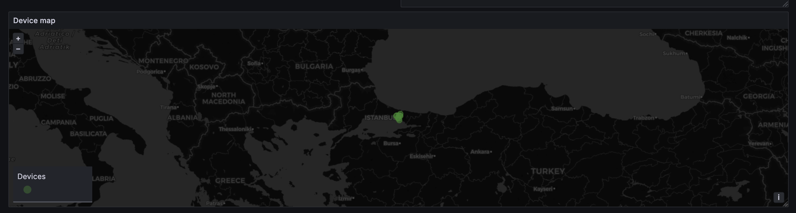

The **Device Detail** dashboard drills into a single device. Below, `dev-10` is mid temperature-spike — its `temp` series has shot past 80 °C and a **CRITICAL** `temp-critical` alert has fired; a second device shows a **WARNING** from the `battery-low` rule.

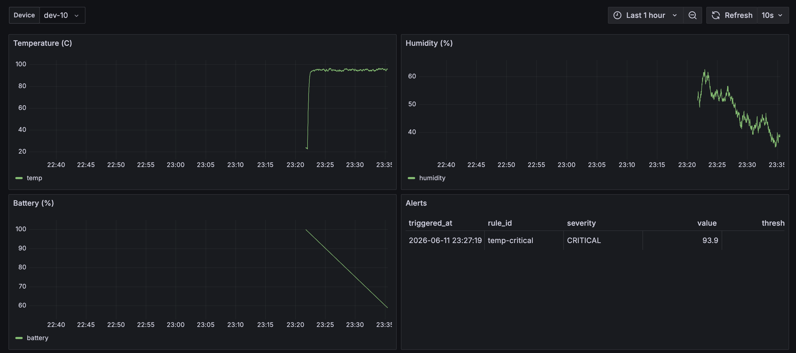
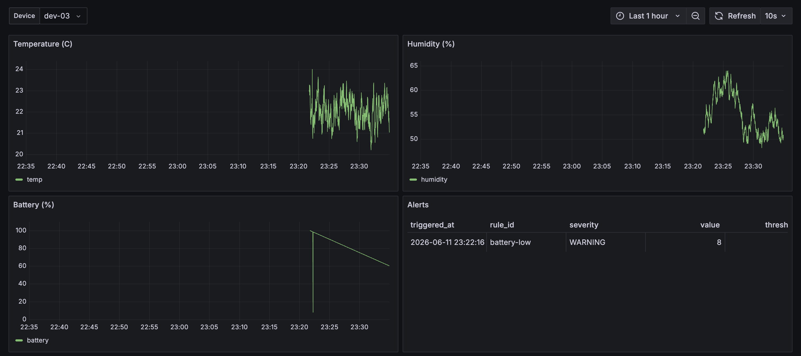

### RabbitMQ — the event backbone

A single topic exchange (`telemetry.events`) routes events to consumer queues, with a parallel dead-letter exchange (`telemetry.events.dlx`) backing every queue. The management UI shows steady ~9 msg/s flowing through, two consumers attached, and the dead-letter bindings in place.

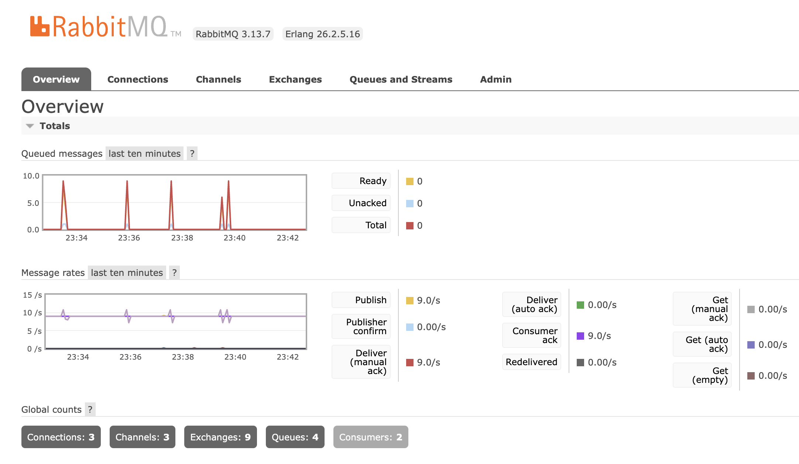
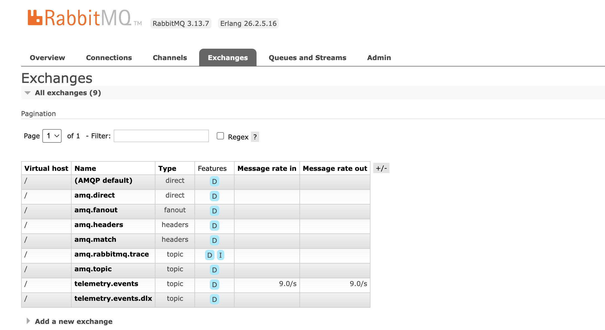
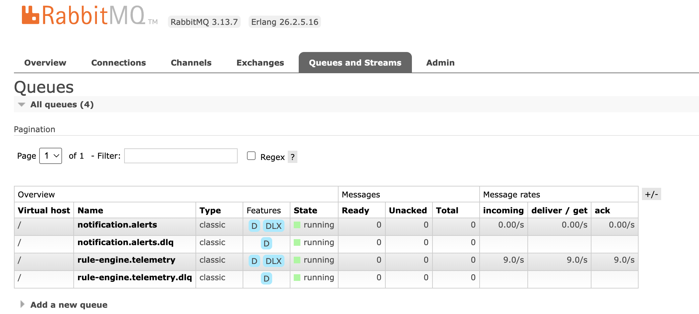
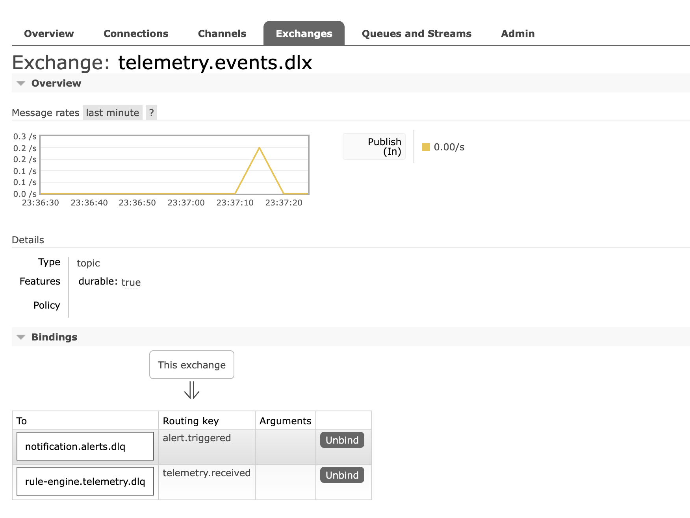

### Data stores

Redis holds one **device shadow** per device (`device:<id>:last`) — the latest full reading. TimescaleDB holds the `telemetry` hypertable, the `devices` registry, the `alerts` table, and the two continuous aggregates.

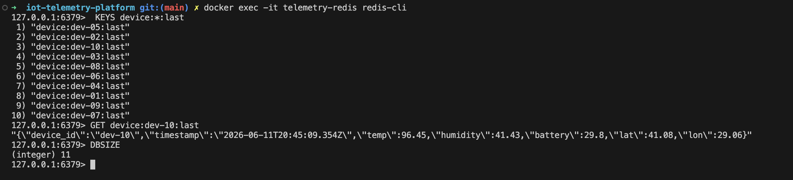
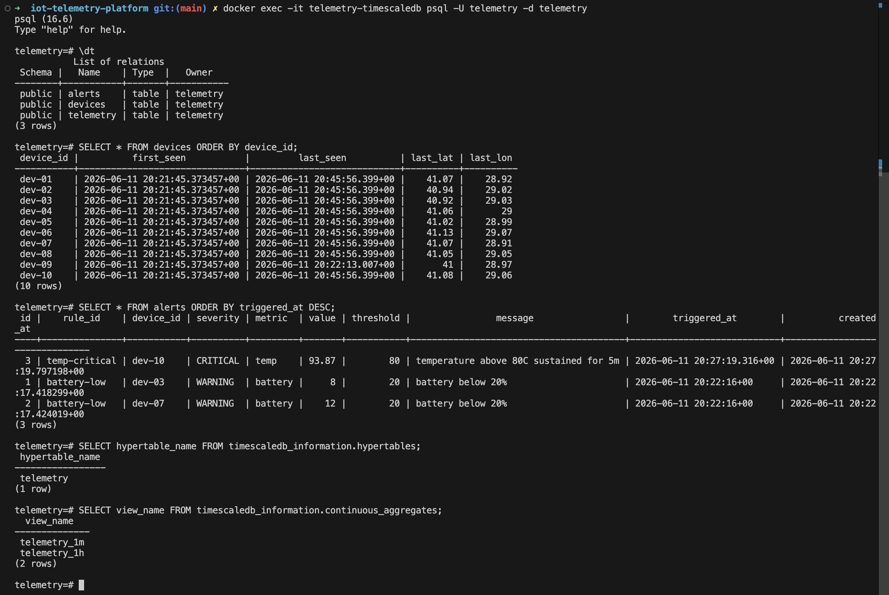

### Observability

Prometheus scrapes all four services (every target healthy), and each service exposes a raw `/metrics` endpoint with both default process metrics and custom `telemetry_*` series.

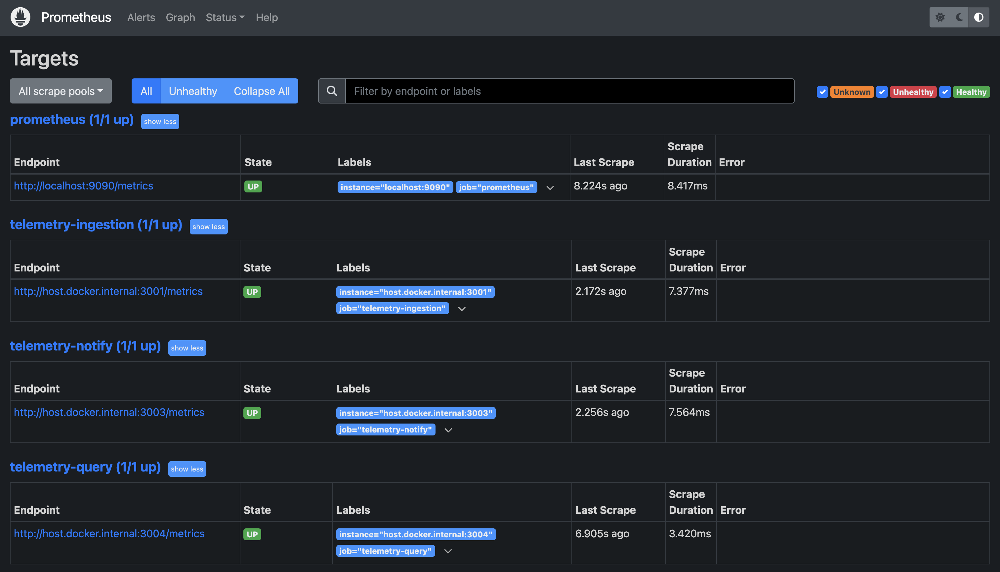
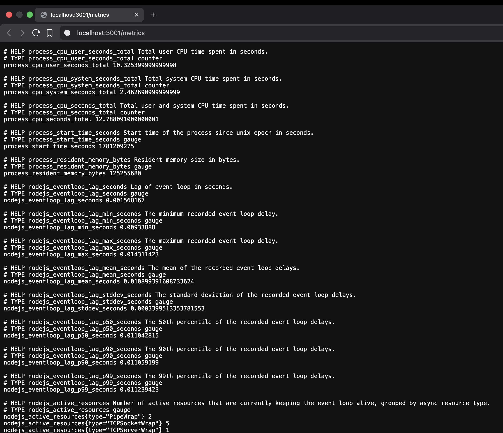

## Data flow & contracts

**Telemetry wire contract** (`@telemetry/types`, validated with Zod at the ingestion edge):

```jsonc
{
  "device_id": "dev-10",
  "timestamp": "2026-06-11T20:45:09.354Z",
  "temp": 96.45,
  "humidity": 41.43,
  "battery": 29.8,
  "lat": 41.08,
  "lon": 29.06
}
```

- **MQTT topic:** `devices/+/telemetry` (per-device, wildcarded on the broker subscription).
- **Redis shadow key:** `device:<id>:last`.
- **RabbitMQ:** exchange `telemetry.events` (topic) + DLX `telemetry.events.dlx`.
  - Routing keys: `telemetry.received`, `alert.triggered`.
  - Queues: `rule-engine.telemetry`, `notification.alerts` (each with a `.dlq`).

## Alerting rules

Rules are plain JSON (`apps/rule-engine/config/rules.json`), validated with Zod and hot-loaded at startup. Two kinds are supported: **threshold** rules, evaluated on each reading with an optional sustain window so transient spikes don't page anyone, and a **connectivity** rule, evaluated by a periodic sweep that flags devices which have gone silent.

| Rule | Kind | Condition | Sustain / silence | Severity |
|---|---|---|---|---|
| `temp-critical` | threshold | `temp > 80 °C` | 5 minutes | **CRITICAL** |
| `battery-low` | threshold | `battery < 20 %` | immediate | **WARNING** |
| `humidity-out-of-range` | threshold | `humidity` outside `30–70 %` | 10 minutes | **WARNING** |
| `device-offline` | connectivity | no telemetry received | 60 seconds | **WARNING** |

Threshold operators: `gt`, `gte`, `lt`, `lte`, `outside`, `inside`. Both sustained breaches and offline episodes are tracked per device-and-rule in Redis and fire exactly once per episode; the rule engine sweeps the device registry every 30 seconds to catch silent devices.

## API

**REST** — Query API on `:3004`:

| Method | Route | Description |
|---|---|---|
| `GET` | `/devices` | Fleet list with `ONLINE` / `OFFLINE` status (derived from `last_seen`). |
| `GET` | `/devices/:id` | Single device plus its latest Redis shadow. |
| `GET` | `/devices/:id/series?metric=&from=&to=&resolution=raw\|1m\|1h` | Time-series for a metric; raw reads the hypertable, `1m`/`1h` read continuous aggregates. |
| `GET` | `/alerts?from=&to=&device=` | Alert history. |
| `GET` | `/health` | Health check (exposed by every service). |
| `GET` | `/metrics` | Prometheus metrics (exposed by every service). |

**gRPC** — `DeviceService` (`proto/telemetry.proto`) on `:5004`: `ListDevices`, `GetDevice`, `GetSeries`.

## Architecture decisions

- **RabbitMQ topic exchange + DLX.** Ingestion, rule evaluation, and notification are fully decoupled: ingestion only publishes facts, and the dead-letter exchange means a failing consumer quarantines a message instead of dropping it.
- **`prefetch(1)` on consumers.** Sustained-breach evaluation is stateful per device, so the rule engine consumes one message at a time — preventing a race on the Redis breach-state when readings for the same device arrive back to back.
- **Zod-first validation, one library.** A single schema source validates environment variables, MQTT payloads, `rules.json`, and HTTP query params; domain types are inferred via `z.infer`, so schema and type never drift.
- **Devices auto-register.** No admin endpoint — a device is `UPSERT`-ed into the registry on its first reading.
- **Continuous aggregates over query-time rollups.** TimescaleDB pre-computes `1m` and `1h` buckets; raw data is kept 24h, `1m` for 7d, `1h` indefinitely.
- **UTC stored, Europe/Istanbul displayed.** Storage is normalized to UTC; Grafana localizes presentation.

## Project structure

```text
iot-telemetry-platform/
├── apps/
│   ├── ingestion-service/      # MQTT → TimescaleDB + Redis + RabbitMQ        (:3001)
│   ├── rule-engine/            # consumes telemetry, evaluates JSON rules      (:3002)
│   ├── notification-service/   # consumes alerts → persist + webhook mock      (:3003)
│   └── query-api/              # REST + gRPC read API                          (:3004)
├── packages/
│   ├── common/                 # RabbitMQ, Redis, metrics, validation pipe
│   ├── database/               # TypeORM entities + TimescaleDB module
│   └── types/                  # shared Zod schemas + event contracts
├── infrastructure/
│   ├── docker/                 # mosquitto config + TimescaleDB init SQL
│   └── monitoring/             # prometheus.yml + Grafana provisioning
├── proto/                      # gRPC service definition
├── scripts/                    # device simulator
└── docker-compose.yml
```

## Getting started

**Prerequisites:** Docker + Docker Compose, Node ≥ 20, pnpm ≥ 10.

```bash
# 1. install dependencies
pnpm install

# 2. build the shared packages (@telemetry/types, common, database)
pnpm build:packages

# 3. create your env file (defaults work out of the box)
cp .env.example .env

# 4. start the infrastructure — 6 containers
pnpm infra:up

# 5. start all four services in watch mode
pnpm dev:all

# 6. in a second terminal, stream a simulated 10-device fleet
pnpm sim
```

Within a few seconds the dashboards start filling in. The simulator includes one device that goes offline and one that drives a temperature spike, so you'll see both an `OFFLINE` device and a live `CRITICAL` alert.

### Everything in containers

To run the full stack — infrastructure **and** all four services — in Docker:

```bash
pnpm up:all   # docker compose --profile full up -d --build
```

This builds a slim multi-stage image per service (≈350 MB) from a single parameterized `Dockerfile` and wires everything together on one network. The default `pnpm infra:up` above instead runs only the infrastructure and leaves the services to `pnpm dev:all` on the host — the better loop for active development. Either way, tear down with `pnpm infra:down`.

> **Note:** TimescaleDB is published on host port **5433** (not the default 5432) to avoid colliding with a local PostgreSQL, and services connect over `127.0.0.1`. Both are already set in `.env.example`.

### Access

| Surface | URL / endpoint | Credentials |
|---|---|---|
| Grafana | http://localhost:3000 | `admin` / `admin` |
| RabbitMQ management | http://localhost:15672 | `telemetry` / `telemetry_dev_password` |
| Prometheus | http://localhost:9090 | — |
| Query API | http://localhost:3004/devices | — |
| Service metrics | http://localhost:3001/metrics | — |
| TimescaleDB | `localhost:5433` (psql) | `telemetry` / `telemetry_dev_password` |
| Redis | `localhost:6379` (redis-cli) | — |
| MQTT | `localhost:1883` | — |

Tear everything down with `pnpm infra:down` (or `pnpm infra:reset` to also wipe volumes).

## Inspecting the stores

```bash
# Redis — device shadows
docker exec -it telemetry-redis redis-cli
127.0.0.1:6379> KEYS device:*:last
127.0.0.1:6379> GET device:dev-10:last

# TimescaleDB — schema, devices, alerts
docker exec -it telemetry-timescaledb psql -U telemetry -d telemetry
telemetry=# \dt
telemetry=# SELECT * FROM devices ORDER BY device_id;
telemetry=# SELECT * FROM alerts ORDER BY triggered_at DESC;
telemetry=# SELECT view_name FROM timescaledb_information.continuous_aggregates;
```

## Observability

Every service mounts a global metrics module that registers default Node/process metrics plus custom series, exposed at `GET /metrics`:

- `telemetry_ingested_total{device_id}` — readings ingested.
- `telemetry_ingestion_lag_seconds` — publish-to-persist latency.
- `telemetry_mqtt_dropped_total{reason}` — rejected payloads.
- `telemetry_rule_evaluations_total{rule_id}` — rule evaluations.
- `telemetry_alerts_triggered_total{rule_id, severity}` — alerts fired.

Prometheus scrapes all four services; Grafana ships two provisioned dashboards (Fleet Overview, Device Detail) wired to both the Prometheus and TimescaleDB datasources.

## Scope

**In scope:** device ingestion, time-series storage, declarative alerting, a read API, observability, and a device simulator.

**Intentionally out of scope:** real device firmware, authentication / multi-tenancy, real SMS or email delivery (a webhook mock stands in), horizontal scaling and Kubernetes, and any cloud deployment. Everything runs locally via Docker Compose.

## License

[MIT](LICENSE) © Hüseyin Canbay
